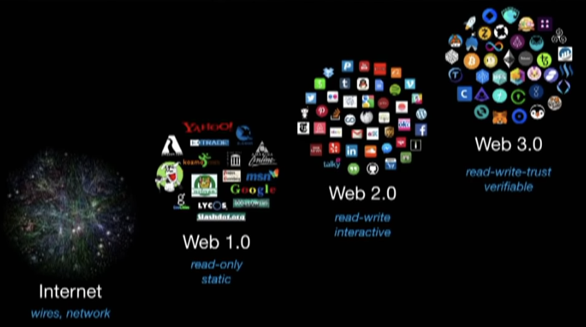
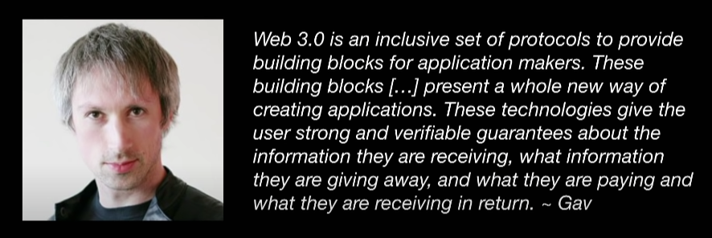
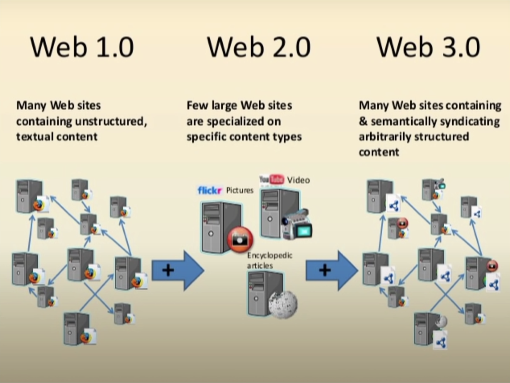

# 🔓 Lock the Web Open

*"Web 3.0 is an executable Magna Carta - the foundation of the freedom of the individual against the arbitrary authority of the despot."* - Gavin Wood

<iframe class="video-frame" src="https://www.youtube-nocookie.com/embed/l44z35vabvA?start=30" frameborder="0" allow="accelerometer; autoplay; encrypted-media; gyroscope; picture-in-picture" allowfullscreen></iframe>

In this video, Juan Benet shows how "Web 3" relates to a larger movement happening across the internet right now, aimed at re-imagining how we share and relate. As such, it forms the third pillar of how we "take back the web" - **cooperation** baked into very the protocols we use for collecting, storing, and consulting the shared record which Vannevar Bush spoke of in 1945. 

## How does this fit into KERNEL?

This week's curated materials have all tried to identify and draw out a particular stream of thought that predates the internet. This is because the internet is just the latest in a long line of attempts to collect and make navigable the sum total of human knowledge. Access to this shared record and the means to move through it meaningfully confer great power. We have a unique opportunity as a generation to ensure both record and means remain open to all.

In particular, this video will help you understand more about

1. The technical history of the web, it's different phases, and where it might be headed next.
2. Why adding **trust** to the read/write web is such an important development.
3. Verifiability, open services, and market protocols as some examples of the new primitives we can use to build different **incentive** structures into Web 3.
4. Smart contracts as the basis for permanent and stable digital jurisdictions.

## Brief

### Introduction

- Web 3 is a part of a larger phase transition in our internet (and our society).  

    - We're going from a pre-computing to a post-computing civilization.
    - This is happening at break-neck speed in terms of the evolutionary history of our species, though it simultaneously feels slow to us as individuals now used to communicating at light-speed with anyone, anywhere.  

- Think of it in terms of **periodic waves:** mainframes, computers, GUIs, the internet, the web, web 2.0, mobile, blockchains, web 3.  

    - Can you imagine where we'll be in 40 years? Exact developments in this sort of timeframe are extremely difficult to predict, though...

> **"The choices that we make in the technologies we build - the properties we give our products - will have drastic implications not just for ourselves, but for many people in the future."**

- Juan then details the key questions which define and constrain the superpowers bestowed by each new wave:  

    - How they work
    - How reliable and correct they are
    - How open and accessible they are
    - How safe they are
    - How they fail
    - Who controls them and how they're governed
    - What rights they secure/guarantee/grant people

> "We must be very careful about the things we build. We should care about maximizing human potential; promoting rights; and the long-term flourishing of humanity when thinking about the technologies we create."

### History

There is a difference between "the internet": the wires and networking protocols which evolved mostly from military and academic work from the 1960's and 70's onward; and "the web": hyperlinked documents, static pages and browsers etc.

#### **Web 1.0 (**1991 to 2000)

Mostly static, read-only content. This also marks the beginning of "online" commercial activity.

#### **Web 2.0** (the early 2000's).

It's key characteristic is its dynamic, interactive nature as opposed to the largely static content of the 90's. It's often described as "the read-write web" and is more participatory, social, and market-based - think not only Facebook and Twitter, but Uber, AirBnB etc.

> **The advertising model in Web 2.0 is broken.** It optimizes for time spent on pages and tries to keep people and their data locked in. Anger is a great way to generate clicks, so we're increasingly optimizing for negative emotions in order to pay the bills.

#### Web 3.0 (now)

This next iteration of the web gives us read, write and [trust](../../module-0/trust/). 

Web 1.0 was about linking content together. Web 2.0 was about linking programs to that content and building rich, dynamic applications which work across our devices. Web 3.0 is about linking content and programs directly to each other, removing intermediaries and gaining public verifiability. Web 3.0 is turning centralized applications into decentralized protocols.

### The path forward

The aim for us should be to take what Bitcoin did to money and do it to all kinds of services and applications. Bitcoin "thawed the peer-to-peer winter and reminded everyone that we can build these kinds of systems and succeed." Now, it's time to hook into the larger movement happening across the internet to change how the web itself works: how we store, retrieve and consult the shared record of human knowledge. 

The simple property of **verifiability** is the key to all this. The "ability to check" is as powerful as the ability to hyperlink text in your documents was in Web 1.0. It's a new kind of linguistic primitive. Most people do not understand this, similar to how hyperlinks were misunderstood early in protocol development. 

### Free thought

- **It is not just blockchains.** It's "the decentralized web" in general. Blockchains systematize economics and law, and did not actually start in the web - Bitcoin was a protocol built to run separately without needing a browser. So a big part of Web 3 work is to make these things actually talk to each other: **to make blockchains accessible to people**.

- This goes to the heart of safer, more resilient, and more ethical protocols which can literally encode social contracts in ways which are visible and meaningful to the people using them.

- **Open services** and **market protocols** are what we're really able to build in Web 3.0. The old economic truths which sunk open source p2p software in the past are no longer true. We can now create commodities out of things that were fixed resources: i.e. storage, computation, and bandwidth. This will allow p2p to compete with centralized alternatives.

- Smart contract systems are the basis of jurisdictions.
    - They are computable law. We won't tap the potential of this for many years to come.
    - So, if you want to bake rights into your systems and "lock the web open" as many of us do, then think about what it means to encode rules into the jurisdiction of the internet, because that's what is really happening here.  

- In a way, the internet is becoming a nation. See J. P. Barlow's "[Declaration of the Independence of Cyberspace](https://www.eff.org/cyberspace-independence)".

### The other web 3

- The linked data, semantic web actually coined the term "Web 3" back in 2004. This idea was started by **Tim Berners-Lee**, and is aimed at making everything interoperable, removing intermediaries and decentralizing the control of information. His approach has been to model ontologies and data so as to connect computers on the machine-readable web.

- The most successful Linked Data work ended up powering the Knowledge Graph and the Facebook Open Graph, which is a far cry from the decentralized vision which started it all. Much like the work on transformative tools for thought, this is due to issues around funding public goods which - if nothing else - blockchains can genuinely help solve.

- The decentralized web movement, the blockchain movement, and the linked data movement are all part of Web 3. **We're in it to build a permanent, ownerless, and borderless foundation for this connected global community of which we are all a part.**

